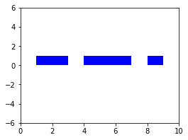
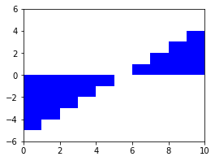
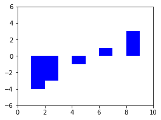
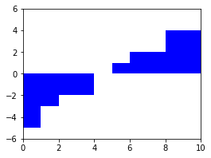

## Intervals
### Initialization
```
from intervals import Intervals

Intervals.from_pairs(((1, 3), (4, 7), (8, 9)))
Intervals((0.0, 2.0), (3.0, 6.0), (7.0, 10.0))
```
#### the union [1, 3) ∪ [4, 7) ∪ [8, 9)
```
>>> i
Intervals((1.0, 3.0), (4.0, 7.0), (8.0, 9.0))
```
#### the union [0, 2) ∪ [3, 6) ∪ [7, 10)
```
>>> j
Intervals((0.0, 2.0), (3.0, 6.0), (7.0, 10.0))

```
### Operations
#### complementation
```
>>> ~i
Intervals((-inf, 1.0), (3.0, 4.0), (7.0, 8.0), ...)
```
#### intersection
```
>>> i & j
Intervals((1.0, 2.0), (4.0, 6.0), (8.0, 9.0))
```
#### inclusion
```
>>> i & j <= i
True
```
#### membership
```
>>> i(2)
True
```
#### measure
```
>>> i.leb()
6.0
```
## Simple Functions
### Initialization
```
from intervals import Intervals, SimpleFunction
from intervals.plotting import plot_sfuncs

i = Intervals.from_pairs(((1, 3), (4, 7), (8, 9)))
x = SimpleFunction.indicator(i)
y = SimpleFunction.approx(fun=lambda x: x-5, start=0, stop=10, num_steps=5)
```
#### indicator of the union [1, 3) ∪ [4, 7) ∪ [8, 9)
```
>>> plot_sfuncs(x, xlim=(0, 10), ylim=(-6, 6))
SimpleFunction(1.0*(1.0, 3.0) + 1.0*(4.0, 7.0) + 1.0*(8.0, 9.0))
```

#### approximation of the function x ↦ x − 5
```
>>> y
SimpleFunction(-5.0*(0.0, 2.0) + -3.0*(2.0, 4.0) + -1.0*(4.0, 6.0) + ...)
```

### Operations
#### multiplication
```
>>> x * y
SimpleFunction(-5.0*(1.0, 2.0) + -3.0*(2.0, 3.0) + -1.0*(4.0, 6.0) + ...)
```

#### addition
```
>>> x + y
SimpleFunction(-5.0*(0.0, 1.0) + -4.0*(1.0, 2.0) + -2.0*(2.0, 3.0) + ...)
```

#### pointwise minimum
```
>>> x & y
SimpleFunction(-5.0*(0.0, 2.0) + -3.0*(2.0, 4.0) + -1.0*(4.0, 6.0) + ...)
```

#### pointwise order
```
>>> x & y <= x
True
```
#### evaluation
```
>>> x(2)
1.0
```
#### integration
```
>>> x.leb()
6.0
```
