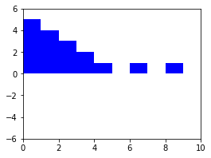
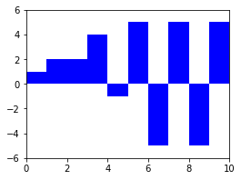
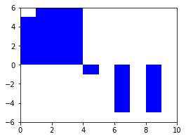
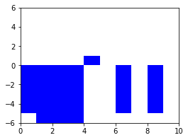

## Intervals
### Initialization
```
from intervals import Intervals

i = Intervals.from_pairs(((1, 3), (4, 7), (8, 9)))
j = Intervals.from_pairs(((0, 2), (3, 6), (7, 10)))
```
#### the union [1, 3) ∪ [4, 7) ∪ [8, 9)
```
>>> i
Intervals((1.0, 3.0), (4.0, 7.0), (8.0, 9.0))
```
#### the union [0, 2) ∪ [3, 6) ∪ [7, 10)
```
>>> j
Intervals((0.0, 2.0), (3.0, 6.0), (7.0, 10.0))

```
### Operations
#### complementation
```
>>> ~i
Intervals((-inf, 1.0), (3.0, 4.0), (7.0, 8.0), ...)
```
#### intersection
```
>>> i & j
Intervals((1.0, 2.0), (4.0, 6.0), (8.0, 9.0))
```
#### inclusion
```
>>> i & j <= i
True
```
#### membership
```
>>> i(2)
True
```
#### measure
```
>>> i.leb()
6.0
```
#### other operations
```
i | j # union
i - j # difference
i ^ j # symmetric difference
i < j # strict inclusion
```
## Simple Functions
### Initialization
```
from intervals import Intervals, SimpleFunction

i = Intervals.from_pairs(((1, 3), (4, 7), (8, 9)))
x = SimpleFunction.indicator(i)
y = SimpleFunction.approx(fun=lambda x: x-5, start=0, stop=10, num_steps=5)
```
#### indicator of the union [1, 3) ∪ [4, 7) ∪ [8, 9)
```
>>> x
SimpleFunction(1.0*(1.0, 3.0) + 1.0*(4.0, 7.0) + 1.0*(8.0, 9.0))
```


#### approximation of the function x ↦ x − 5
```
>>> y
SimpleFunction(-5.0*(0.0, 2.0) + -3.0*(2.0, 4.0) + -1.0*(4.0, 6.0) + ...)
```

### Operations
#### multiplication
```
>>> x * y
SimpleFunction(-5.0*(1.0, 2.0) + -3.0*(2.0, 3.0) + -1.0*(4.0, 6.0) + ...)
```

#### addition
```
>>> x + y
SimpleFunction(-5.0*(0.0, 1.0) + -4.0*(1.0, 2.0) + -2.0*(2.0, 3.0) + ...)
```

#### pointwise minimum
```
>>> x & y
SimpleFunction(-5.0*(0.0, 2.0) + -3.0*(2.0, 4.0) + -1.0*(4.0, 6.0) + ...)
```

#### pointwise order
```
>>> x & y <= x
True
```
#### evaluation
```
>>> x(2)
1.0
```
#### integration
```
>>> x.leb()
6.0
```
#### other operations
```
-i    # negation
i | j # pointwise maximum
i - j # difference
i < j # strict pointwise order
```
## Compositions
### Initialization
```
from intervals import Intervals, SimpleFunction, Composition

i = Intervals.from_pairs(((1, 3), (4, 7), (8, 9)))
x = SimpleFunction.indicator(i)
y = SimpleFunction.approx(fun=lambda x: x-5, start=0, stop=10, num_steps=5)

z = x & y
f = Composition.from_callable(sfunc=z, fun=abs)
```
#### z = x ∧ y
```
>>> z
SimpleFunction(-5.0*(0.0, 2.0) + -3.0*(2.0, 4.0) + -1.0*(4.0, 6.0) + ...)
```


#### f = |z|
```
>>> f
Composition(array([5., 4., 3., 2., 1., 0., 1.]))
```


Every function g of the form g = h ∘ z is indexed an array of length seven. Similarly, every such array corresponds to a unique function g of the form g = h ∘ z.

```
from numpy.random import randint

g = Composition.from_coef(sfunc=z, coef=randint(low=-6, high=6, size=7))
```
#### g = h ∘ z for some function h
```
>>> g
Composition(array([ 1.,  2.,  2.,  4., -1.,  5., -5.]))
```

### Operations
#### multiplication
```
>>> f * g
Composition(array([ 5.,  8.,  6.,  8., -1.,  0., -5.]))
```

```
>>> z * g
SimpleFunction(-5.0*(0.0, 1.0) + -8.0*(1.0, 2.0) + -6.0*(2.0, 3.0) + ...)
```
```

```
#### other operations
Compositions can perform all the same operations as simple functions. Operations between compositions are much faster than operations between simple functions or between compositions and simple functions.


